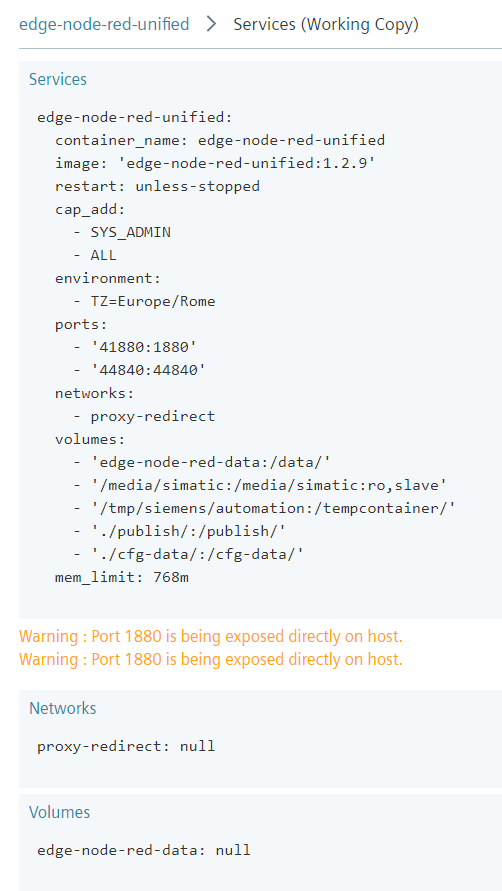

# EDGE Node-RED Unified

Node-RED Docker Application for UNIFIED COMFORT PANELS with some of most used Node-RED Nodes preinstalled.

## Table of Contents

- [EDGE Node-RED Unified](#edge-node-red-unified)
  - [Table of Contents](#table-of-contents)
  - [Install the App](#install-the-app)
    - [Requirements](#requirements)
    - [Download the App](#download-the-app)
    - [Prerequisites](#prerequisites)
    - [Load App on Unified Comfort Panels](#load-app-on-unified-comfort-panels)
  - [Run the App](#run-the-app)
  - [Extra Mapped Port for Additional Services](#extra-mapped-port-for-additional-services)
  - [WinCC Unified Communication with OpenPipe Nodes](#wincc-unified-communication-with-openpipe-nodes)
  - [Extra nodes in package.json](#extra-nodes-in-packagejson)
  - [How the App is built from scratch](#how-the-app-is-built-from-scratch)
    - [`package.json`](#packagejson)
    - [`docker-compose.yml`](#docker-composeyml)
    - [`Dockerfile`](#dockerfile)
  - [Import in Edge App Publisher](#import-in-edge-app-publisher)
  - [References](#references)
  - [Release History](#release-history)
  - [License](#license)
  - [Contributing](#contributing)

## Install the App

_Edge Node-RED Unified_ comes with pre-builded `edge-node-red-unified_x.x.x.app` package that can be installed specifically on Unified Comfort Panels that runs SIMATIC Edge Runtime.

### Requirements

> Before loading this application, check if the requirements above are satisfied by the selected Edge Device for installation.

In order to run this Edge App, the selected Edge System need to satisfy the following requirements:

| Description                    |           |
| ------------------------------ | --------- |
| Available Working Memory (RAM) | >= 768 MB |
|                                |           |

### Download the App

The **edge-node-red-unified** app can be downloaded in .app format using this secure Google Drive link:

- [edge-node-red-unified_3.0.2.app](https://drive.google.com/file/d/1pvTYPB2oZ-DpZXj8qL5__WUjO4m4c05C/view?usp=sharing)

### Prerequisites

1. A Unified Comfort Panel with SIMATIC Edge feature enabled.
2. At least one user needs to be signed up

### Load App on Unified Comfort Panels

1. Copy the downloaded `edge-node-red-unified_x.x.x.app` file to your Developer PC.
2. Open the Industrial Edge Management Web Page of UCP on `https://<ucp-address>`
3. Import the .app file using the _Import Offline_ button
4. Wait until App is installed

## Run the App

Once the app has been installed the Docker service starts running immediately.

You can access the app web interface by clicking on the _edge-node-red-unified_ app icon in Edge Device Web Page or through endpoint.
The app has two HTTPS Endpoints configured with SIMATIC Edge Reverse Proxy function:

- `https://<ied-address>/edge-node-red` : this endpoint open the Node-RED editor interface. This is the default endpoint.
- `https://<ied-address>/edge-node-red-ui` : this endpoint open the Node-RED Web Dashboard.

To open the Node-RED editor a user must be logged.Below the default Login credentials:

- **user:** edge
- **password:** edge


> A user must be logged on Edge Device in order to open Reverse Proxy App endpoints. If no user is logged the endpoint URL will give Error 503 on load.

If you need, is it possible to access the app Endpoints also by using the following direct URLs with mapped ports:

- `https://<ied-address>:41880` : this endpoint open the Node-RED editor interface.
- `https://<ied-address>:41880/edge-node-red-ui` : this endpoint open the Node-RED Web Dashboard.

## Extra Mapped Port for Additional Services

There is also an additional Port mapped through the docker-compose.yml file that is the port **44840** that could be used for extra services and features that require a dedicated port like e.g. exposure of an OPCUA Server with `node-red-contrib-opcua` node.

## WinCC Unified Communication with OpenPipe Nodes

The main reason why this app is specific for Unified Comfort Panels is that, among the various pre-installed nodes, some of them are dedicated to communication with **WinCC Unified** (as default on UCPs) for exchange Tags and Alarms data with the HMI supervision system.

The installed nodes use the **OpenPipe Socket** communication channel, which requires a dedicated volume in the Edge App.
These nodes are contained in the `openpipe_nodes` folder copied in the Docker image building phase.
For more information on how this feature was integrated, see chapter [How the App is built from scratch](#how-the-app-is-built-from-scratch).

## Extra nodes in package.json

Node-RED comes with a core set of useful nodes, but there are many more available from both the Node-RED project as well as the wider community.
You can search for available nodes in the [Node-RED library](https://flows.nodered.org/).

The following snippets of `package.json` file lists all the extra nodes installed in this Node-RED App:

```json
{
  ...
  ...
    "dependencies": {
        "node-red": "3.0.2",
        "@mindconnect/node-red-contrib-mindconnect": "^3.12.1",
        "node-red-contrib-azureiothubnode": "^0.5.3",
        "node-red-contrib-influxdb": "^0.6.1",
        "node-red-contrib-mssql-plus": "^0.7.3",
        "node-red-node-mysql": "^1.0.3",
        "node-red-contrib-postgres-variable": "^0.1.5",
        "node-red-contrib-s7": "^3.1.0",
        "node-red-contrib-opcua": "^0.2.295",
        "node-red-contrib-modbus": "^5.25.0",
        "node-red-contrib-cip-ethernet-ip": "^1.1.3",
        "node-red-contrib-string": "^1.0.0",
        "node-red-contrib-telegrambot": "^15.0.1",
        "node-red-node-ping": "^0.3.3",
        "node-red-contrib-moment": "^4.0.0",
        "node-red-dashboard": "^3.3.1",
        "node-red-node-email": "^1.18.4",
        "node-red-node-openweathermap": "^0.5.1",
        "node-red-node-random": "^0.4.1",
        "node-red-contrib-ui-led": "^0.4.11",
        "node-red-node-ui-table": "^0.4.3",
        "node-red-node-base64": "^0.3.0",
        "node-red-node-msgpack": "^1.2.1",
        "node-red-node-suncalc": "^1.0.1",
        "node-red-hmi-subscribe-alarms": "file:hmi-runtime-subscribe-alarms",
        "node-red-hmi-subscribe-tags": "file:hmi-runtime-subscribe-tags",
        "node-red-hmi-write-tags": "file:hmi-runtime-write-tags",
        "node-red-hmi-read-tags": "file:hmi-runtime-read-tags",
        "node-red-hmi-read-alarms": "file:hmi-runtime-read-alarms"
    }
}
```

You can also install nodes directly within the editor by selecting the `Manage Palette` option from the main menu to open the [Palette Manager](https://nodered.org/docs/user-guide/editor/palette/manager).

On Node-RED Documentation Website you can find more information on how to [Add nodes to the palette](https://nodered.org/docs/user-guide/runtime/adding-nodes).

## How the App is built from scratch

This App is based on the official [Node-RED Docker Image](https://hub.docker.com/r/nodered/node-red).
On Node-RED Documentation Website you can find more information on [How to Run Node-RED Docker](https://nodered.org/docs/getting-started/docker) and how to generate [Image Variation](https://nodered.org/docs/getting-started/docker#image-variations) for own customization.

The following sections will describe each file used for generate this App:

### `package.json`

To add any extra nodes on Node-RED Docker base image it is necessary to insert them into the original `package.json` file available from [node-red-docker Repository](https://github.com/node-red/node-red-docker) and build a new docker image.

See the complete list of available Node-RED nodes for this App version on chapter [Extra nodes in package.json](#extra-nodes-in-packagejson)

### `docker-compose.yml`

The Node-RED Docker base image used in this App is built using [docker-compose](https://docs.docker.com/compose/) tool with the command `docker-compose up -d --build` on the following `docker-compose.yml` file:

```yaml
version: "2.4"

services:
  edge-node-red-unified:
    container_name: edge-node-red-unified
    build:
      context: ./edge-node-red-unified
      dockerfile: Dockerfile
      args:
        - NODE_RED_VERSION=3.0.2
    image: edge-node-red-unified:3.0.2
    restart: always
    #privileged: true
    cap_add:
      - SYS_ADMIN
      #- DAC_READ_SEARCH
      - ALL
    environment:
      - TZ=Europe/Rome
    ports:
      - "41880:1880"
      - "44840:44840"
    networks:
      - proxy-redirect
    volumes:
      - edge-node-red-data:/data/
      - /tmp/siemens/automation:/tempcontainer/
      - /media/simatic:/media/simatic:ro,slave
    mem_limit: 768m

volumes:
  edge-node-red-data:
    name: edge-node-red-data

networks:
  proxy-redirect:
    name: proxy-redirect
```

The above compose file:

- creates the `edge-node-red-unified` service container
- build our custom Node-RED Docker image using `./edge-node-red-unified/Dockerfile` file and passing to it the argument **3.0.2** as the wanted `NODE_RED_VERSION` to be installed
- sets the timezone to `Europe/Rome`
- Maps the container port 1880 to the the host port **41880** (for Node-RED Web Interface)
- Maps the container port 44840 to the the host port **44840** (for extra features like e.g. exposure of an OPCUA Server with `node-red-contrib-opcua` node.)
- persists the `/data` dir inside the container to the`edge-node-red-data` volume in the Host System.
- map the `/media/simatic` folder for External Disks inside the container
- map the Openpipe socket `/tmp/siemens/automation` in the container folder `/tempcontainer/`

### `Dockerfile`

In order to customize the Docker base image of this App, the following `Dockerfile` was used:

```dockerfile
ARG NODE_RED_VERSION=latest
########################################################################################
FROM nodered/node-red:${NODE_RED_VERSION}-minimal as BASE

USER root

# install needed packages
RUN apk add --update-cache \
        cifs-utils \
    && rm -rf /var/cache/apk/*

# Copy package.json to the WORKDIR so npm builds all
# of your added nodes modules for Node-RED
COPY package.json .

# Copy OpenPipe Commmunication Nodes
COPY openpipe-nodes/ .

# copy custom settings and start script
COPY settings.js .
COPY start.sh .

########################################################################################
FROM BASE as BUILD

USER root

# Install devtools for building new nodes on minimal image
RUN apk add --no-cache --virtual buildtools build-base linux-headers udev python3 && \
    npm install --unsafe-perm --no-update-notifier --no-fund --only=production &&\
    chmod -R 777 .

########################################################################################
FROM BASE AS RELEASE

USER node-red

# copy builded node modules from BUILD
COPY --from=BUILD /usr/src/node-red/node_modules ./node_modules

# Clean up
RUN rm -rf /tmp/*

ENTRYPOINT ["/bin/sh", "start.sh"]
```

Taking the argument `NODE_RED_VERSION` passed by docker-compose file, docker start building process from node-red base image `nodered/node-red:<NODE_RED_VERSION>-minimal` and the new `package.json` file and `openpipe-nodes` nodes folder are copied to new docker image.
User and ui endpoint are set up in the `settings.js`file that is copied togheter in this build phase.
The _minimal_ version is used to reduce the amount of space of the `RELEASE` Docker Image as it not include all the linux build packages used for install new nodes.

In the `BUILD` phase, the needed Linux packages for nodes installation are installed by `apk add` command, then all nodes are installed by `npm install` command.

For the `RELEASE` phase the `BASE` minimal image is used and the `node_modules` folder builded on `BUILD` phase are copied to the `WORKDIR` folder.
The `ENTRYPOINT` command will start Node-RED using `/data` folder as root directory.

## Import in Edge App Publisher

By importing the `docker-compose.yml` file in the Edge App Publisher some changes are applied in order to make the app compatible with the SIMATIC Edge environment:

- The `build` parameter is deleted since the image was already builded.
- In the **Storage** Section of the imported App a new volume for USB Media Mounting was added by using the pre-configured option.
- In the **Storage** Section of the imported App a new volume for WinCC Communication with Openpipe Socket was added by using the pre-configured option.


- In the **Network** section of the imported App two Reverse Proxy endpoints was defined with following parameters:

  | Port | Type | Service Name     | Rewrite Target    |
  | ---- | ---- | ---------------- | ----------------- |
  | 1880 | HTTP | edge-node-red    | /                 |
  | 1880 | HTTP | edge-node-red-ui | /edge-node-red-ui |
  |      |      |                  |                   |


- The `mem_limit` parameter is added since is a mandatory field for SIMATIC Edge applications.

Below you can find the extracted `docker-compose` file from the Edge App:



## References

- [SIOS Application Example NodeRED](https://support.industry.siemens.com/cs/ww/en/view/109778780) - This application example is based on the following Siemens Industry Online Support Application example provided by Siemens.
- [Node-RED Library](https://flows.nodered.org/) - Official Node-RED Collection of Nodes and Example Flows.
- [Node-RED Docker Image](https://hub.docker.com/r/nodered/node-red) - Official Node-RED Docker Image from Docker Hub.
- [Node-RED Documentation](https://nodered.org/docs/) - Node-RED Documentation Portal for every needs.
- [OpenPipe Manual](https://support.industry.siemens.com/cs/it/en/view/109778823) - Siemens Industry Support Manual for OpenPipe Communication functions understanding.

## Release History

- 3.0.2
  - Update to Node-RED v.3.0.2
  - Update extra nodes
- 0.0.13
  - Update to Node-RED v.2.1.3
  - Update OpenPipe nodes to 0421
  - Update extra nodes
  - Add iputils to image
- 0.0.12
  - Update to Node-RED v.1.2.9
  - Add login user
  - Add reverse proxy
- 0.0.6
  - The first proper release.

## License

Distributed under the MIT License. See `LICENSE` for more information.

## Contributing

1. Fork it ([https://github.com/yourname/yourproject/fork](https://github.com/yourname/yourproject/fork))
2. Create your feature branch (`git checkout -b feature/fooBar`)
3. Commit your changes (`git commit -am 'Add some fooBar'`)
4. Push to the branch (`git push origin feature/fooBar`)
5. Create a new Pull Request
